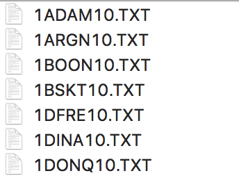
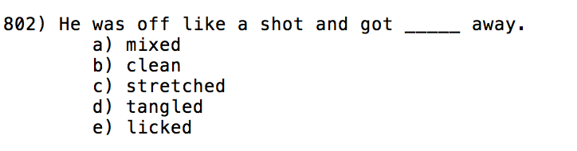

# Cloze-cloze
2018 下半学期、nlp作业
## task description: 选词填空
>给定训练集，在dev set 上验证准确率，对test set选词填空

>选择了dev集上准确率最高的 gensim predict_output_word 对test选词填空，生成答案列表

>train set example:
>>

>dev set( as same as test set) example:
>>

## Note:
Lstm-for-cloze.ipynb is incomplete! Still waiting for further work.


## data set description:

Microsoft提出的特殊的数据集，该数据集被用于证实n-gram模型的不足之处
  
reference: [A Challenge Set for Advancing Language Modeling](https://www.microsoft.com/en-us/research/wp-content/uploads/2016/02/holmes.pdf  )

raw train set: 522 .txt, ~=240MB
dev: 240
test: 800

## methods:

1. n-gram(n = 2,3,4,5): 
    * 平滑: +1:
      1. 句子概率
      2. 句子中n元组出现的次数(频次)乘积
    * 平滑: +0.5: 
      1. 句子概率
      2. 句子中n元组出现的次数(频次)乘积
2. gensim:
    * word2vec score (calculates the loss based on the context words present in the sentence,refer:[How-does-Gensim-Word2vec-calculate-the-probability-of-text-using-a-model-score](https://www.quora.com/How-does-Gensim-Word2vec-calculate-the-probability-of-text-using-a-model-score))
    
          parameters: hs = 1,sample = 0.001,window = 10,size = 300,min_count = 10,workers = 7
    * predict_output_word( CBOW训练词向量得出的预测概率 )
          
          parameters: hs = 1,window=10,size = 300,min_count = 5,workers = 7
    * 相似度度量
      候选答案和句子中其他词的相似度之和，选取最大的那个
          
          parameters: hs = 1,window=10,size = 300,min_count = 5,workers = 7
          

## Dependencies
* anaconda3
* jupyter notebook
* gensim

      conda install gensim
* nltk

      1. conda install nltk
      2. nltk.download() to download clause data
 
## Dir
```
./Training_Data.zip
./development_set_answers.txt
./development_set.txt
./test_set.txt
```    
  
## Usage
step1. unzip Training_Data.zip

step2. run prepare-dataset.ipynb
    
    After clean, train set have 737385 sentences, 88726 unique words.

step3. run Deal.ipynb

step4. run result.ipynb

After step1-4, the dir should be:
```
./Training_Data.zip
./development_set_answers.txt
./development_set.txt
./test_set.txt

./result.txt (final result.txt)
./dev-sentences.txt (put answer into dev sentences for n-gram model)
./Training_Data/ (unzip Training_Data.zip)
./train-sentences.txt (train sentences after clean)
```  
## Accuracy
| model | smooth num | accuracy(n=2,3,4,5 for n-gram) |
| ----- | ----- | ----- |
|n-gram(概率) | 1 |0.3, 0.3458333333333333, 0.35, 0.2916666666666667|
|n-gram(频次) | 1 |0.31666666666666665, 0.375, 0.3541666666666667, 0.2875|
|n-gram(概率) | 0.5 |0.3, 0.35833333333333334, 0.35, 0.2916666666666667|
|n-gram(频次) | 0.5 |0.32083333333333336, 0.3875, 0.3541666666666667, 0.2875|
|gensim score | - |0.4625|
|gensim predict_output_word | - |0.5458333333333333|
|相似度度量|-|0.44583333333333336|

